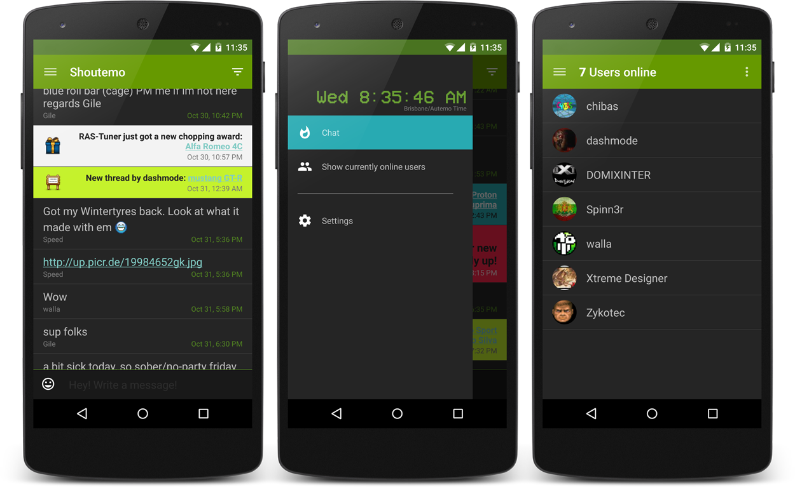

#Shoutemo

## About

_Shoutemo_ is the group chat app for [autemo.com](http://autemo.com/forums/).
With it you can use the shoutbox of autemos forums on your Android phone much more conveniently and with additional features:

* **Endless storage of the chat history**. (On [autemo.com](http://autemo.com/forums/) only the 50 newest posts can be seen at any time.)
* **Convenient usage**: As being a native app all the trouble that comes with using the (non-adapting) website on the mobile browser goes away: No need to resize, no slow performance, no incompatibility. Simply delightful to use.
* **No authentication hassle**: Once the user logs in, his credentials get handled by Androids [Account Authentication System](http://developer.android.com/reference/android/accounts/AbstractAccountAuthenticator.html). From there on, just start the app and you're ready to go.
* **Smiley selector**: No weird bbcode any more.. just tap the smiley. It's as easy as that!
* **Filters**: Looking for that one competition announcement? Fear no more! Shoutemo provides filters to get back control over your chat history.
* See who is currently online and ready to chat!
* Many more additional features coming soon...
* **New in Version 2.0**: Brand new Material Design!

## Screenshots

## With the help of…

* [JSoup](http://jsoup.org/)
* [Glide](https://github.com/bumptech/glide)
* [Guava](http://code.google.com/p/guava-libraries/)
* Some icons from [Project Icons](http://fav.me/d2ksp9k) by [Mihaiciuc Bogdan](http://bogo-d.deviantart.com) (Creative Commons Attribution 3.0)

## License

**Copyright 2013-2016 MSal**

This program is free software: you can redistribute it and/or modify it under the terms of the GNU General Public License as published by the Free Software Foundation, either version 3 of the License, or (at your option) any later version.  
This program is distributed in the hope that it will be useful, but WITHOUT ANY WARRANTY;
without even the implied warranty of MERCHANTABILITY or FITNESS FOR A PARTICULAR PURPOSE.
See the GNU General Public License for more details.  
You should have received a copy of the GNU General Public License along with this program. If not, see [http://www.gnu.org/licenses/](http://www.gnu.org/licenses/).
